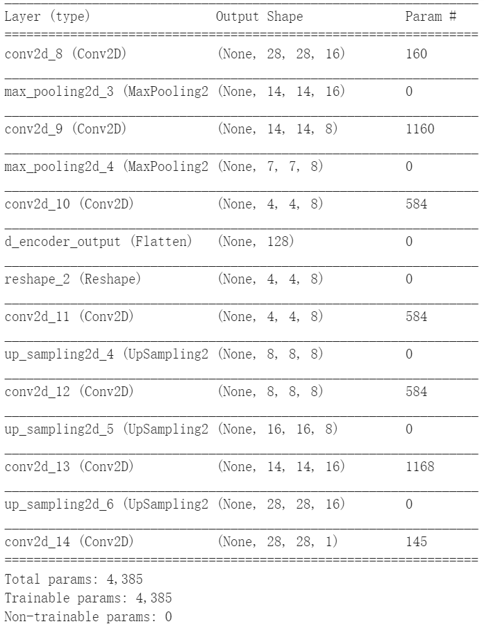
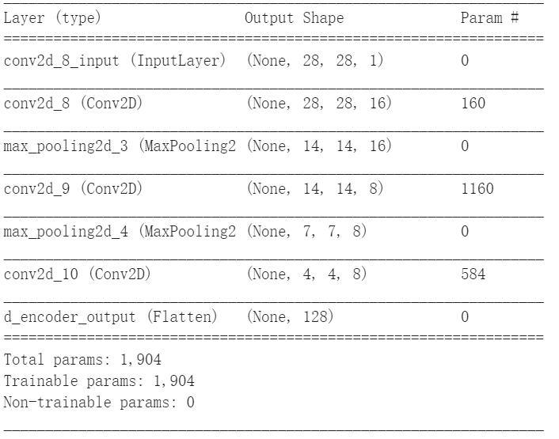

# Deep learning and feature visualization 
**何云帆 516370910010**   
**group members: Fan Xie, Yuyi Gu, Yiyuan Zhou, Yunfan He**
## Image reconstruction and Feature analysis
### Introduction
* Dataset: MINST
* Model: Convolutional autoencoder
* Method for feature analysis: t-SNE
* A potential problem: Can this convolutional autoencoder denoise the image to reconstruct image without noise, which is the common useage of autoencoder? We test with our model with noisy data, and the result is horrible.

* Our solution to this problem: we use (train_images_noisy, train_images) as training data and (test_images_noisy, test_images) as validation data.

* The structure of convolutional autoencoder:   

* The structure of encoder:  
