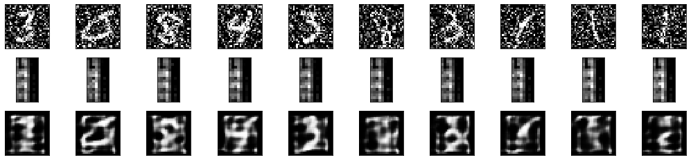
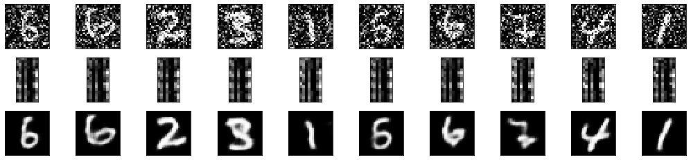
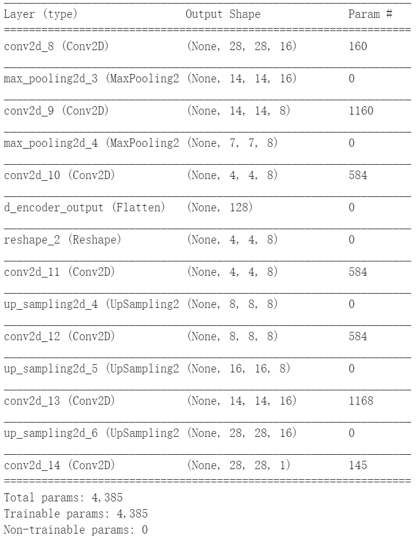
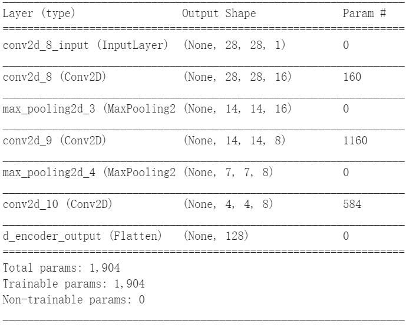
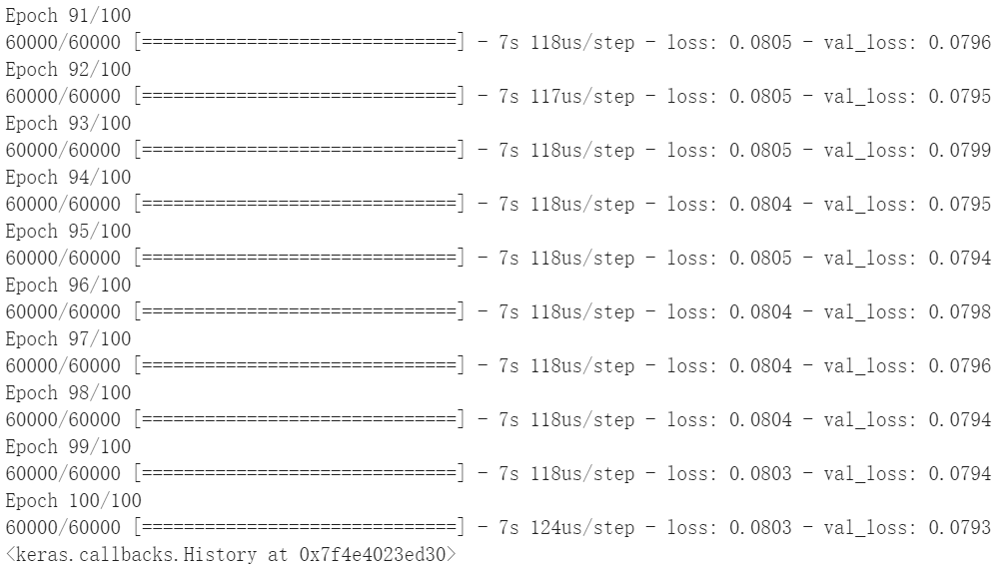
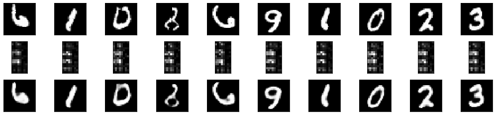
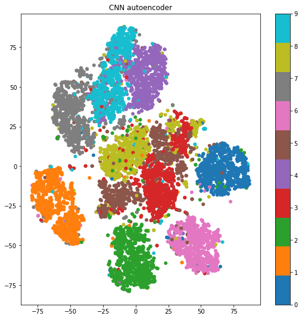
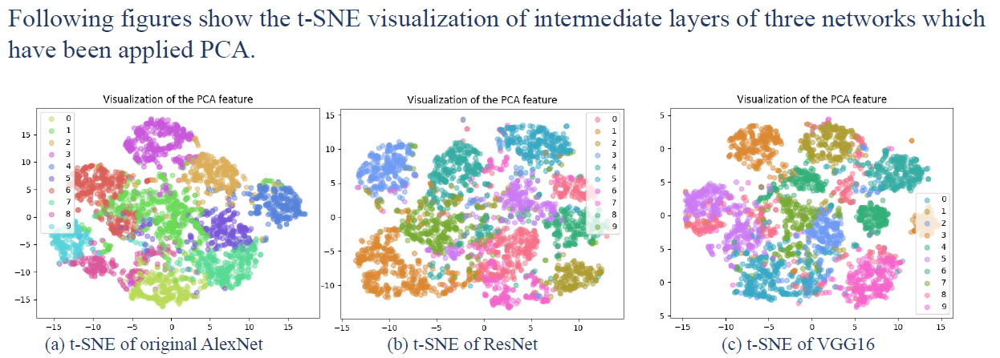
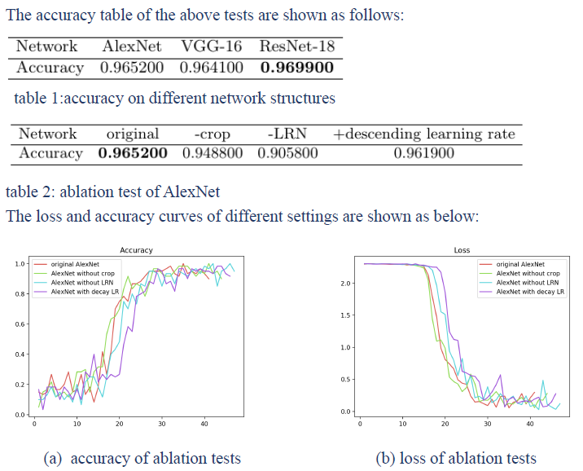
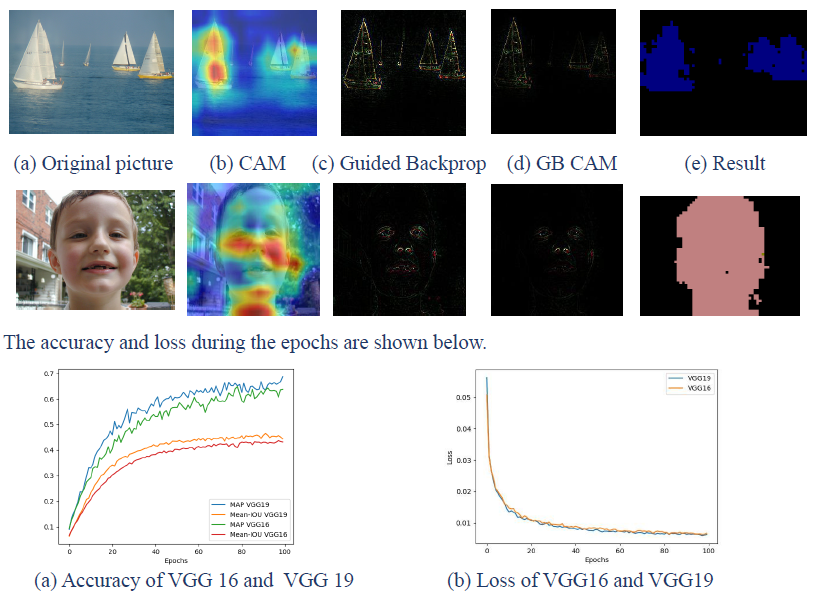

# Deep learning and feature visualization 
**何云帆 516370910010**   
**group members: Fan Xie, Yuyi Gu, Yiyuan Zhou, Yunfan He**
## Image reconstruction and Feature analysis
### Introduction
* Dataset: MINST
* Model: Convolutional autoencoder
* Method for feature analysis: t-SNE
* A potential problem: Can this convolutional autoencoder denoise the image to reconstruct image without noise, which is the common useage of autoencoder? We test with our model with noisy data, and the result is horrible.

* Our solution to this problem: we use (train_images_noisy, train_images) as training data and (test_images_noisy, test_images) as validation data.

* The structure of convolutional autoencoder:   

* The structure of encoder:  


### Methodology
1. **Import necessary module and dataset**
    ```
    import numpy as np
    import pandas as pd

    import keras
    from keras.models import Sequential, Model
    from keras.layers import Dropout, Flatten, Dense, Conv2D, MaxPooling2D, Input, Reshape, UpSampling2D
    from keras.utils import np_utils, to_categorical

    from keras.datasets import mnist

    import matplotlib.pyplot as plt
    %matplotlib inline
    ```
    The dataset MNIST is contained in Keras module, which is easy for us to import.  
2. **Split test and train set**
    ```
    # Preprocess
    # from normaliztion to original image int(x*255)
    (train_images, train_labels_raw), (test_images, test_labels_raw) = mnist.load_data() 

    train_images = train_images.reshape((60000, 784)) # Reshape the data
    train_images = train_images.astype('float32') / 255 # Normalization

    test_images = test_images.reshape((10000, 784)) # Reshape the data
    test_images = test_images.astype('float32') / 255 # Normalize between 0 and 1

    # Convert labels to one-hot data
    train_labels = to_categorical(train_labels_raw) # we can use it for CNN classification
    test_labels = to_categorical(test_labels_raw)
    # x_train = np.reshape(x_train, (len(x_train), 28, 28, 1))
    train_images=np.reshape(train_images,(len(train_images),28,28,1))
    test_images=np.reshape(test_images,(len(test_images),28,28,1))
    ```
    We take the raw data out, reshape data from 28by28 to 784by1 and normalize the data from 0-255 to 0-1. We also make each the label of images be one-hot data, which may be useful when we use minst in CNN classification.  
3. **build the convolutional autoencoder and its encoder**
    ```
    autoencoder = Sequential()

    # Encoder Layers
    autoencoder.add(Conv2D(16, (3, 3), activation='relu', padding='same', input_shape=(28, 28, 1)))
    autoencoder.add(MaxPooling2D((2, 2), padding='same'))
    autoencoder.add(Conv2D(8, (3, 3), activation='relu', padding='same'))
    autoencoder.add(MaxPooling2D((2, 2), padding='same'))
    autoencoder.add(Conv2D(8, (3, 3), strides=(2,2), activation='relu', padding='same'))

    # Flatten encoding for visualization
    autoencoder.add(Flatten(name='encoder_output'))
    autoencoder.add(Reshape((4, 4, 8)))

    # Decoder
    autoencoder.add(Conv2D(8, (3, 3), activation='relu', padding='same'))
    autoencoder.add(UpSampling2D((2, 2)))
    autoencoder.add(Conv2D(8, (3, 3), activation='relu', padding='same'))
    autoencoder.add(UpSampling2D((2, 2)))
    autoencoder.add(Conv2D(16, (3, 3), activation='relu'))
    autoencoder.add(UpSampling2D((2, 2)))
    autoencoder.add(Conv2D(1, (3, 3), activation='sigmoid', padding='same'))

    autoencoder.summary()
    ```
    The structure of the autoencoder is like a sand clock, and it contracts in the middle to learn the feature of the picture. We name the layer in the middle of the autoencoder "encoder_output" to extract the encoder from autoencoder.  
    ```
    encoder = Model(inputs=autoencoder.input, outputs=autoencoder.get_layer('encoder_output').output)
    encoder.summary()
    ```
4. **train the autoencoder**
    ```
    autoencoder.compile(optimizer='adam', loss='binary_crossentropy')
    autoencoder.fit(train_images, train_images,epochs=100,batch_size=128,validation_data=(test_images, test_images))
    ```
    The input data is train_images and the desired output is train_images, which is an unsupervised learning process. We train the autoencoder with 100 epochs. The following picture is our training process.  
    
5. **result**
   ```
    num_images = 10
    random_test_images = np.random.randint(test_images.shape[0], size=num_images)

    encoded_imgs = encoder.predict(test_images)
    decoded_imgs = autoencoder.predict(test_images)

    plt.figure(figsize=(18, 4))

    for i, image_idx in enumerate(random_test_images):
        # original image
        ax = plt.subplot(3, num_images, i + 1)
        plt.imshow(test_images[image_idx].reshape(28, 28))
        plt.gray()
        ax.get_xaxis().set_visible(False)
        ax.get_yaxis().set_visible(False)
        
        # encoded image
        ax = plt.subplot(3, num_images, num_images + i + 1)
        plt.imshow(encoded_imgs[image_idx].reshape(16, 8))
        plt.gray()
        ax.get_xaxis().set_visible(False)
        ax.get_yaxis().set_visible(False)

        # plot reconstructed image
        ax = plt.subplot(3, num_images, 2*num_images + i + 1)
        plt.imshow(decoded_imgs[image_idx].reshape(28, 28))
        plt.gray()
        ax.get_xaxis().set_visible(False)
        ax.get_yaxis().set_visible(False)
    plt.show()
   ```
    
    The first row is the original picture. The second row is the output of layer in the middle which will be used in feature generation. The third row is the result of the reconstruction.
5. **feature generation using t-SNE**
   ```
    import sklearn
    from sklearn.manifold import TSNE

    tsne=TSNE(n_components=2,init='pca',random_state=0)
    X_tsne=tsne.fit_transform(encoded_imgs)

    plt.figure(figsize=(9, 9))
    plt.scatter(X_tsne[:, 0], X_tsne[:, 1], c=test_labels_raw, cmap='tab10',linewidths=0.00000001)
    plt.colorbar()
    plt.title("CNN autoencoder")
    plt.show()
   ```
    
    We can conclude from the figure that each number has its own feature, and the model and t-SNE divde the features very well.  

### Problem we met
I have heard that some autoencoders can be used for denoising, so I want to test whether our model can denoise the noisy image to a good image. However, the result is horrible.
```
train_images_noisy = train_images + np.random.normal(loc=0.0, scale=0.5, size=train_images.shape)
train_images_noisy = np.clip(train_images_noisy, 0., 1.)

test_images_noisy = test_images + np.random.normal(loc=0.0, scale=0.5, size=test_images.shape)
test_images_noisy = np.clip(test_images_noisy, 0., 1.)

num_images = 10
random_test_images = np.random.randint(test_images.shape[0], size=num_images)

encoded_imgs = encoder.predict(test_images_noisy)
decoded_imgs = autoencoder.predict(test_images_noisy)

plt.figure(figsize=(18, 4))

for i, image_idx in enumerate(random_test_images):
    # original image
    ax = plt.subplot(3, num_images, i + 1)
    plt.imshow(test_images_noisy[image_idx].reshape(28, 28))
    plt.gray()
    ax.get_xaxis().set_visible(False)
    ax.get_yaxis().set_visible(False)
    
    # encoded image
    ax = plt.subplot(3, num_images, num_images + i + 1)
    plt.imshow(encoded_imgs[image_idx].reshape(16, 8))
    plt.gray()
    ax.get_xaxis().set_visible(False)
    ax.get_yaxis().set_visible(False)

    # plot reconstructed image
    ax = plt.subplot(3, num_images, 2*num_images + i + 1)
    plt.imshow(decoded_imgs[image_idx].reshape(28, 28))
    plt.gray()
    ax.get_xaxis().set_visible(False)
    ax.get_yaxis().set_visible(False)
plt.show()
```

We can see the number from the orginal image with some noise, while we cannot find out the number after the reconstruction. Therefore, that is a potential problem that we need to conquer.

### The solution of the problem
we use (train_images_noisy, train_images) as training data and (test_images_noisy, test_images) as validation data.
```
d_autoencoder = Sequential()

# Encoder Layers
d_autoencoder.add(Conv2D(16, (3, 3), activation='relu', padding='same', input_shape=(28, 28, 1)))
d_autoencoder.add(MaxPooling2D((2, 2), padding='same'))
d_autoencoder.add(Conv2D(8, (3, 3), activation='relu', padding='same'))
d_autoencoder.add(MaxPooling2D((2, 2), padding='same'))
d_autoencoder.add(Conv2D(8, (3, 3), strides=(2,2), activation='relu', padding='same'))

# Flatten encoding for visualization
d_autoencoder.add(Flatten(name='d_encoder_output'))
d_autoencoder.add(Reshape((4, 4, 8)))

# Decoder
d_autoencoder.add(Conv2D(8, (3, 3), activation='relu', padding='same'))
d_autoencoder.add(UpSampling2D((2, 2)))
d_autoencoder.add(Conv2D(8, (3, 3), activation='relu', padding='same'))
d_autoencoder.add(UpSampling2D((2, 2)))
d_autoencoder.add(Conv2D(16, (3, 3), activation='relu'))
d_autoencoder.add(UpSampling2D((2, 2)))
d_autoencoder.add(Conv2D(1, (3, 3), activation='sigmoid', padding='same'))

d_autoencoder.summary()
```
Build a new autoencoder.
```
d_encoder = Model(inputs=d_autoencoder.input, outputs=d_autoencoder.get_layer('d_encoder_output').output)
d_encoder.summary()
```
Extract an encoder from the new autoencoder.
```
d_autoencoder.compile(optimizer='adam', loss='binary_crossentropy')
d_autoencoder.fit(train_images_noisy, train_images,epochs=100,batch_size=128,validation_data=(test_images_noisy, test_images))
```
Use (train_images_noisy, train_images) as training data and (test_images_noisy, test_images) as validation data.
```
num_images = 10
random_test_images = np.random.randint(test_images.shape[0], size=num_images)

encoded_imgs = d_encoder.predict(test_images_noisy)
decoded_imgs = d_autoencoder.predict(test_images_noisy)

plt.figure(figsize=(18, 4))

for i, image_idx in enumerate(random_test_images):
    # original image
    ax = plt.subplot(3, num_images, i + 1)
    plt.imshow(test_images_noisy[image_idx].reshape(28, 28))
    plt.gray()
    ax.get_xaxis().set_visible(False)
    ax.get_yaxis().set_visible(False)
    
    # encoded image
    ax = plt.subplot(3, num_images, num_images + i + 1)
    plt.imshow(encoded_imgs[image_idx].reshape(16, 8))
    plt.gray()
    ax.get_xaxis().set_visible(False)
    ax.get_yaxis().set_visible(False)

    # plot reconstructed image
    ax = plt.subplot(3, num_images, 2*num_images + i + 1)
    plt.imshow(decoded_imgs[image_idx].reshape(28, 28))
    plt.gray()
    ax.get_xaxis().set_visible(False)
    ax.get_yaxis().set_visible(False)
plt.show()
```

The result looks better now. The model has the ability to denoise.

### other problems we met
1. When we first use MINST dataset, we use much time to find out how the structure of the data, what is the size of each picture, and how to reshape the data for the CNN.
2. When we design the structure of the autoencoder, we only know that it contracts in the middle. We test several sizes of the convolutional layer and choose the best of them to be our structure. 

### other group members' work
1. Image Classification: Experiments are conducted on AlexNet. We first compare constant learning rate with descending learning rate. Results come that the constant learning rate converges faster than descending learning rate. Moreover, we have investigated the effect of removing local response normalization layer (LRN). In our experiment, we come up with the conclusion that it has nothing to do with the convergence speed.
    
    
2. Image Segmentation: we have applied Fully Convolutional Network based on VGG on CUB200 and Pascal VOC dataset. Image segmentation is a harder task than classification since it requires linking different part of the image in order to understand the relations between the objects.
    